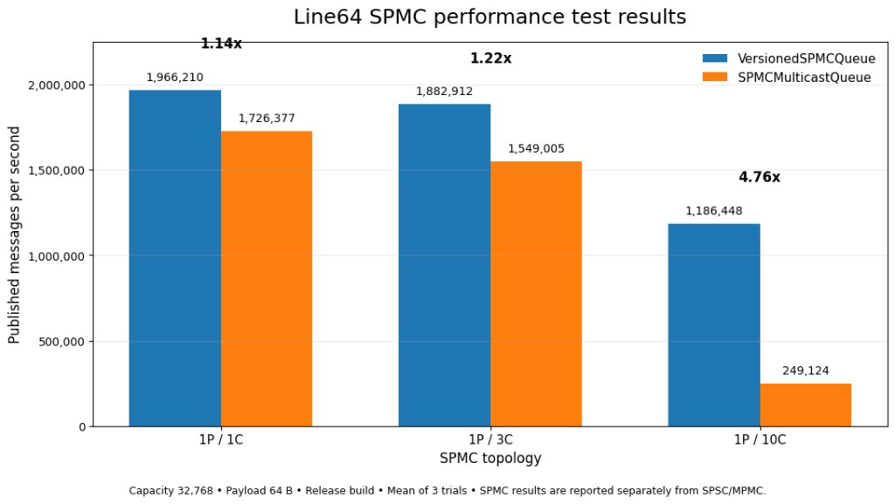
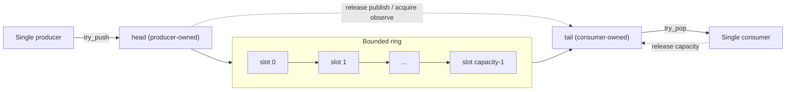
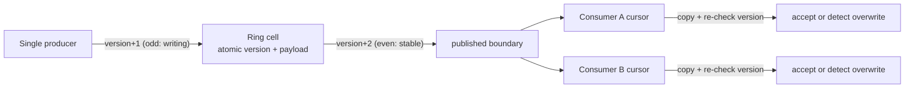
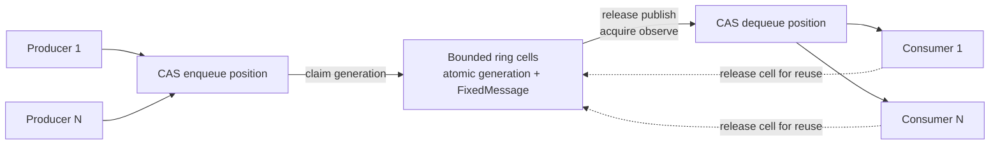
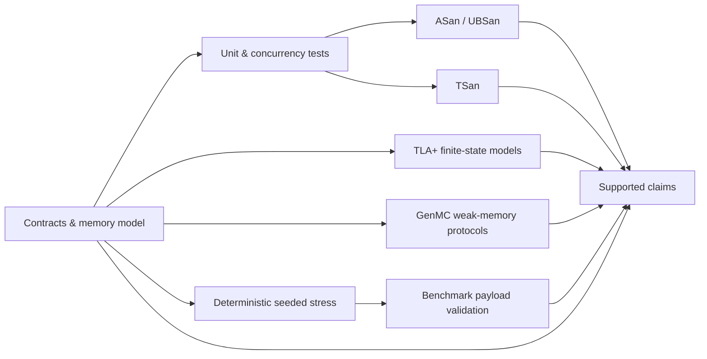

# Line64 — Lock-Free Bounded Concurrent Queues for C++20

[](https://github.com/suhaasgaddala/Line64/actions/workflows/ci.yml)
[](https://github.com/suhaasgaddala/Line64/actions/workflows/verification.yml)
[](https://en.cppreference.com/w/cpp/20)
[](#quick-start)
[](LICENSE)

**Line64** is a header-only, zero-dependency C++20 library of bounded concurrent
queues built for ultra-low-latency message passing: a **lock-free SPSC** ring, a
**mutex-free seqlock SPMC** multicast path, a **mutex-free CAS MPMC** work-sharing
ring, and mutex-backed baselines. Every queue is validated with **TLA+ and GenMC
model checking**, **ThreadSanitizer**, and **deterministic seeded stress**, and
benchmarked head-to-head against Boost.Lockfree, moodycamel, rigtorp, and
atomic_queue.

## Highlights

- ⚡ **Up to 4.76× higher SPMC throughput** — the atomic-versioned, mutex-free
  `VersionedSPMCQueue` (a per-cell seqlock) beats the conventional mutex-protected
  multicast queue across every topology, and pulls away as consumer count grows.
- 🏎️ **MPMC competitive with the fastest production queues** — the mutex-free
  CAS `MPMCQueue` lands within a few percent of `atomic_queue`, `moodycamel`, and
  `boost::lockfree::queue`, and runs **2.4–2.7× faster than a mutex baseline**
  under contention.
- 🔒 **Genuinely lock-free SPSC** — single-writer acquire/release indices, no CAS,
  no mutex; within **4%** of specialized SPSC queues (rigtorp, Boost) while
  keeping a richer fixed-payload API.
- 🧪 **Verified, not just tested** — 4 TLA+ finite-state models, GenMC weak-memory
  protocol harnesses (RC11), ASan/UBSan + TSan CI, and a 50k-message contention
  test, all green. The most rigorous run validated **87/87 benchmark rows** with
  **zero** payload or accounting errors.
- 📦 **Drop-in** — header-only, no mandatory dependencies, CMake `find_package`
  install with a downstream consumption test in CI.
- 🎯 **Explicit contracts** — every queue documents its producer/consumer model,
  overflow behavior, memory ordering, and progress guarantee. No silent data loss,
  no hand-waving.

## Performance

All numbers below come from a single validated run — Apple M4 (10 cores), macOS,
AppleClang Release, capacity `32,768`, payload `64 B`, `1s` measured per scenario
after `250 ms` warmup, mean of 3 trials, **87/87 rows validated with 0 errors**.
The benchmark binary emits JSONL, so every figure is regenerated from measured
output — none are hand-entered.

### SPMC multicast — mutex-free seqlock vs. conventional mutex

The headline result: replacing one global mutex with a **per-cell atomic version
(seqlock)** removes the centralized publication bottleneck, and the gap widens as
consumers scale.

| Topology | `VersionedSPMCQueue` (mutex-free) | `SPMCMulticastQueue` (mutex) | Speedup |
|---|---:|---:|---:|
| 1P / 1C  | 1,966,210 msg/s | 1,726,377 msg/s | **1.14×** |
| 1P / 3C  | 1,882,912 msg/s | 1,549,005 msg/s | **1.22×** |
| 1P / 10C | 1,186,448 msg/s |   249,124 msg/s | **4.76×** |



Both queues deliver identical multicast retained-history semantics (every consumer
observes every publication), so this is an apples-to-apples comparison of
synchronization strategy alone.

### MPMC work-sharing — vs. external baselines

The mutex-free `MPMCQueue` (a Vyukov sequence-cell ring) is benchmarked against
the best-known production MPMC queues. It is competitive across the board and
leaves the mutex-backed baseline far behind under contention.

| Queue | 1P/1C | 2P/2C | 4P/4C | vs. Line64 MPMC |
|---|---:|---:|---:|:--:|
| `atomic_queue::AtomicQueueB2`  | 1,889,764 | 3,589,929 | 2,359,185 | 1.00–1.07× |
| **Line64 `MPMCQueue`**         | **1,882,846** | **3,363,076** | **2,280,157** | **1.00×** |
| `moodycamel::ConcurrentQueue`  | 1,805,396 | 3,346,192 | 2,331,844 | 0.96–1.02× |
| `boost::lockfree::queue`       | 1,785,237 | 3,219,304 | 2,057,698 | 0.90–0.96× |
| Line64 `BlockingQueue` (mutex) |   1,742,240 | 2,428,053 |   852,846 | 0.37–0.93× |

At 4P/4C the mutex-free queue delivers **2.7×** the throughput of the mutex-backed
`BlockingQueue`. Some baselines edge ahead in specific higher-contention
topologies — Line64 makes no claim of universal dominance, only that it is in the
same performance class as the field's best, with full correctness validation the
others don't ship with.

### SPSC exclusive handoff

`SPSCQueue` is the library's truly lock-free path. It stays within **4%** of
`rigtorp::SPSCQueue` and `boost::lockfree::spsc_queue` while keeping Line64's
fixed-payload API and explicit status results.

| Queue | Mean msg/s | Relative |
|---|---:|---:|
| `rigtorp::SPSCQueue`            | 1,940,678 | 1.04× |
| `boost::lockfree::spsc_queue`   | 1,931,582 | 1.04× |
| **Line64 `SPSCQueue`**          | **1,863,926** | **1.00×** |

> SPMC multicast throughput is reported separately from SPSC/MPMC because one
> published message is observed by every consumer — aggregate multicast reads are
> not comparable to exclusive-pop work.

## Queue Family

| Queue | Producers | Consumers | Synchronization | Progress / role |
|---|---:|---:|---|---|
| `SPSCQueue<N>` | 1 | 1 | Single-writer atomics | **Lock-free** exclusive handoff |
| `VersionedSPMCQueue<N>` | 1 | many | Per-cell atomic version (seqlock) | Mutex-free multicast; wait-free publish |
| `SPMCMulticastQueue<N>` | 1 | many | One mutex over publish/copy | Conservative multicast baseline |
| `MPMCQueue<N>` | many | many | Sequence-cell + CAS, no mutex | Mutex-free work sharing |
| `BlockingQueue<T>` | many | many | Mutex + condition variable | Blocking baseline |

The fixed-payload queues accept `std::span`, reject oversized messages, hide slot
storage, and return explicit status, byte-count, and logical-sequence results.

## How It Works

### Lock-free SPSC ring



The producer is the only writer of `head`; the consumer the only writer of `tail`.
No index is written by more than one thread, so the queue needs no CAS and no
mutex — release/acquire handoffs publish payload bytes and prevent slot reuse
during a copy. This is the one queue carrying a lock-free claim.

### Atomic-versioned (seqlock) SPMC



Each cell owns an even/odd atomic version: even means stable, odd means a publish
is in progress. A consumer reads the version, copies the payload, then re-reads
the version; if it changed (or was odd) the snapshot was torn and is rejected
rather than returned, so partial payloads are never delivered. Every guarded field
is a relaxed atomic under release/acquire fences, so an overlapping read is always
a well-defined atomic access (no data race, no UB) — which is what keeps the queue
clean under ThreadSanitizer. `try_publish` is wait-free; each `try_read` completes
in a bounded number of seqlock retries and returns `overwritten`/`consumer_lagged`
under pressure instead of spinning forever.

### Mutex-free MPMC sequence cells



Enqueue/dequeue counters allocate unique positions with relaxed CAS; per-cell
acquire/release generation values transfer ownership of payload bytes. Capacity is
a power of two. Based on Dmitry Vyukov's array-based bounded MPMC algorithm.

## Correctness & Validation

Performance means nothing without proof of correctness. Line64 layers six
independent forms of evidence:



- **Formal models** — 4 TLA+ specs check bounded-FIFO conservation, SPSC ownership
  transfer, multicast registration/lag semantics, and MPMC sequence-cell claim and
  reuse (the MPMC model explores 14,265 distinct states). GenMC harnesses check the
  SPSC/MPMC atomic protocols and multicast mutex exclusion under the RC11 memory
  model. Both run in CI.
- **Sanitizers** — separate ASan/UBSan and TSan CI jobs run the full CTest suite.
- **Contention test** — a 50,000-message MPMC test with 4 producers / 4 consumers
  validates every payload ID and logical sequence exactly once.
- **Seeded stress** — reproducible payloads carrying global/local sequences,
  producer IDs, and checksums; first-failure reproduction data is printed.
- **Packaging** — an isolated install + `find_package` + compile + run test.

See [memory model](docs/memory_model.md),
[correctness strategy](docs/correctness_strategy.md), and
[concurrency verification](verification/README.md).

## Quick Start

Requires CMake ≥ 3.20 and a C++20 compiler.

```sh
cmake -S . -B build -DCMAKE_BUILD_TYPE=Debug
cmake --build build --parallel
ctest --test-dir build --output-on-failure
```

Run the deterministic stress matrix:

```sh
./build/stress/orbitqueue_stress --queue all --seed 12345 --duration-ms 250 --iterations 10000
```

Benchmark a Release build (emits JSONL):

```sh
cmake -S . -B build-release -DCMAKE_BUILD_TYPE=Release
cmake --build build-release --parallel
./build-release/benchmarks/orbitqueue_benchmark --duration-ms 250 --warmup-ms 50 --trials 3
```

Optional external baselines (Boost, moodycamel, rigtorp, atomic_queue) are
disabled by default; enable them with the `LINE64_ENABLE_*` CMake flags.

## Usage

```cpp
#include <array>
#include <span>
#include "orbitqueue/spsc_queue.h"

orbitqueue::SPSCQueue<64> queue(1024);                       // payload ≤ 64 B, capacity 1024

const std::array payload{std::byte{0x10}, std::byte{0x20}};
const auto write = queue.try_push(std::span<const std::byte>{payload});

std::array<std::byte, 64> out{};
const auto read = queue.try_pop(std::span<std::byte>{out});

if (read.status != orbitqueue::QueueStatus::success) {
    // Handle full / empty / message_too_large explicitly — no exceptions on the hot path.
}
```

The mutex-free multicast path mirrors this, with per-consumer cursors:

```cpp
#include "orbitqueue/versioned_spmc_queue.h"

orbitqueue::VersionedSPMCQueue<64> queue(1024);
auto reader = queue.make_consumer();                          // register before publishing to observe it

queue.try_publish(std::span<const std::byte>{payload});

std::array<std::byte, 64> out{};
const auto read = reader.try_read(std::span<std::byte>{out});
if (read.status == orbitqueue::QueueStatus::overwritten ||
    read.status == orbitqueue::QueueStatus::consumer_lagged) {
    // A slow consumer fell behind; its cursor resumed at the oldest retained sequence.
}
```

`MPMCQueue<N>` takes a power-of-two capacity and supports many producers and
consumers with try-only `try_push` / `try_pop`. See [queue contracts](docs/queue_contracts.md).

## Install and Consume

```sh
cmake --install build-release --prefix "$HOME/.local"
```

```cmake
find_package(OrbitQueue CONFIG REQUIRED)
target_link_libraries(your_target PRIVATE OrbitQueue::orbitqueue)
```

The installed package name, `OrbitQueue::orbitqueue` target, `include/orbitqueue`
path, and `orbitqueue` namespace are stable compatibility identifiers retained
across the rename to Line64.

## Design Background

Line64's multicast path evolved from a global-index Disruptor-style design — a
producer reserves a slot, writes the payload, advances a published boundary, and
consumers gate on the slowest cursor. That model (see the
[LMAX Disruptor user guide](https://lmax-exchange.github.io/disruptor/user-guide/index.html),
Trisha Gee's [*Dissecting the Disruptor*](https://trishagee.com/2011/07/04/dissecting_the_disruptor_writing_to_the_ring_buffer/),
and David Gross's [*Trading at Light Speed*](https://meetingcpp.com/mcpp/schedule/talkview.php?tid=220))
is easy to reason about, but its shared sequence indices become contention points
as consumers grow — which is exactly the bottleneck the per-cell seqlock removes.
More in [design decisions](docs/design_decisions.md) and
[design explorations](docs/design_explorations.md).

## Scope & Honest Limitations

Line64 is an engineering-research library, and its claims are deliberately precise:

- **Lock-free claims are scoped.** `SPSCQueue` is lock-free. `VersionedSPMCQueue`
  is mutex-free with a wait-free single-producer publish and bounded-step,
  non-blocking reads — but carries no blanket lock-free claim. `MPMCQueue` is
  mutex-free without a lock-free/wait-free claim.
- Benchmarks are single-machine (Apple M4) snapshots; absolute numbers vary by
  platform. Throughput across different delivery semantics is not comparable.
- Model checking and sanitizers cover bounded models and executed schedules — they
  are strong evidence, not an unbounded refinement proof of the full C++ source.
- Position/logical-sequence counter exhaustion is outside the supported lifetime.

Treating these limits as part of the contract — rather than burying them — is the
point. See [PROJECT_CONTEXT.md](PROJECT_CONTEXT.md) for the full evidence model.

## Documentation

- [Architecture](docs/architecture.md) · [Queue contracts](docs/queue_contracts.md) · [MPMC design](docs/mpmc_queue.md)
- [Memory model](docs/memory_model.md) · [Correctness strategy](docs/correctness_strategy.md) · [Concurrency verification](verification/README.md)
- [Stress testing](docs/stress_testing.md) · [Benchmarking](docs/benchmarking.md)
- [Research motivation](docs/research_motivation.md) · [Design decisions](docs/design_decisions.md) · [Design explorations](docs/design_explorations.md)

## License

MIT — see [LICENSE](LICENSE).
