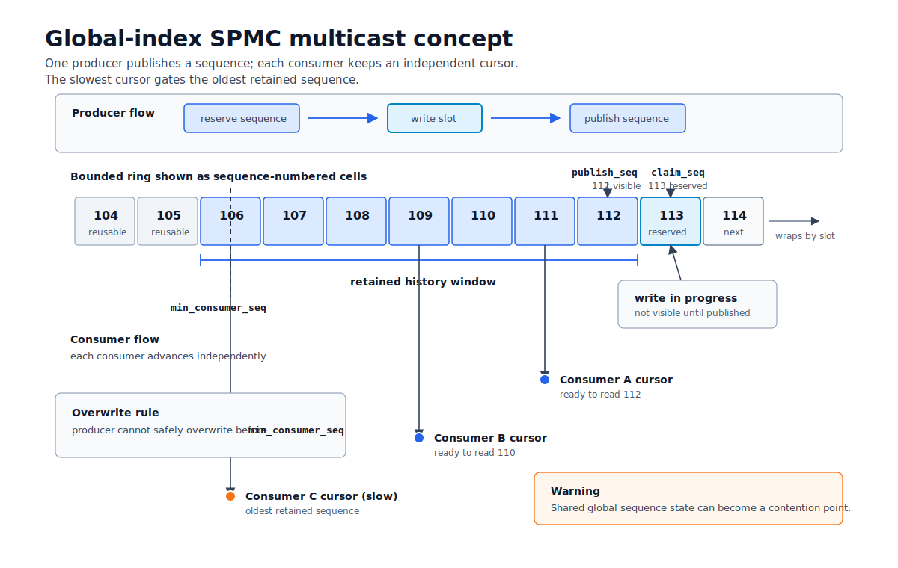

# Queue Design Decisions

This document records the technical alternatives considered for the queue
family and explains why the current contracts and mechanisms were selected.
Public headers and executable tests remain the source of truth.

## Current Design

| Concern | Current decision |
| --- | --- |
| Language and packaging | C++20 header-only library with target-scoped CMake and downstream `find_package` coverage |
| Payload storage | Compile-time bounded storage with span-based input and output |
| Blocking work sharing | `BlockingQueue<T>` with capacity validation, try operations, close, wakeup, and drain behavior |
| SPSC work sharing | `SPSCQueue<N>` with single-writer head/tail ownership, FIFO logical sequences, and no unread overwrite |
| SPMC multicast | `SPMCMulticastQueue<N>` with registered consumers, independent cursors, retained-history lag detection, and queue-owned synchronization |
| MPMC work sharing | `MPMCQueue<N>` with sequence-numbered cells, CAS position claims, power-of-two capacity, and try-only operations |
| Benchmark payload | One sequence-bearing, checksummed representation shared by every scenario |
| Measurement output | Machine-readable trials with workload, validation, retry, throughput, and build metadata |
| Optional baselines | Boost.Lockfree, moodycamel, rigtorp, and atomic_queue benchmark scenarios behind disabled-by-default flags |

## Alternatives Excluded From Public APIs

| Alternative | Reason for exclusion |
| --- | --- |
| Callback writes into raw queue slots | Exposes internal memory and cannot enforce payload bounds |
| Caller-managed consumer indices | Permits unchecked indexing and cannot reliably identify slot generations |
| Per-slot odd/even multicast protocol | Does not prevent a producer rewrite during a non-atomic consumer payload copy and permits lost consumer metadata updates |
| SPSC unread/version protocol | Couples ownership to subtle shared metadata, skips positions after failed writes, and complicates validation |
| Conflicting global queue types | Prevents safe inclusion and leaks implementation details; public APIs remain namespaced |
| Unchecked capacity, payload size, or destination size | Produces undefined behavior instead of an explicit result |
| Mandatory Boost dependency | Couples the core library to a benchmark-only comparison implementation |
| Machine-specific compiler and dependency paths | Prevents portable configuration and downstream consumption |
| Directory-wide CMake configuration | Leaks flags and include paths across unrelated targets |
| Monolithic queue/benchmark executable | Mixes contracts, synchronization, measurement, and shutdown behavior |
| Type-erased benchmark callbacks | Hide queue-specific stop, close, and drain requirements |
| Blocking pop without closure | Can strand consumers after producers stop |
| Aggregate counters without semantic labels | Conflate multicast observations with unique work-sharing pops |
| Fixed-duration-only benchmarks | Slow smoke feedback and prevent controlled repetitions |
| Throughput rankings without equivalent work | Produce unsupported performance conclusions |

## SPSC Decision

The required SPSC behavior is exactly-once FIFO work sharing without
overwriting unread data. The selected head/tail design covers that contract
directly:

- exactly one producer and one consumer own their respective positions;
- a full queue returns `full` without publishing or skipping a message;
- logical publication sequences begin at one;
- boundary tests cover empty, full, FIFO, payload limits, and invalid capacity;
- concurrent tests validate payload and sequence integrity through wraparound;
- sanitizer configurations exercise the same contract.

No unread flag or caller-managed ring index is required.

## Multicast Decision

Multicast consumers must advance independently while observing complete
payloads. A version check before a payload copy cannot stop a writer from
starting during that copy. The current implementation therefore holds a mutex
across publication and copy, tracks each consumer with an owned cursor, and
reports lag when retained history has been overwritten.

The global-index illustration below is useful for understanding the contention
question, but it is not the current synchronization protocol.

## Benchmark Decisions

Work-sharing and multicast measure different units. Work-sharing trials require
one valid pop per publication after drain. Multicast trials report aggregate
consumer observations separately from unique publication IDs. Every measured
payload carries an ID and checksum so loss, duplication, and corruption can be
reported instead of hidden by a throughput total.

The benchmark harness groups scenarios by delivery semantics before throughput
is compared. SPSC exclusive handoff, MPMC exclusive-pop work sharing, and SPMC
multicast retained history are separate groups. Optional external baselines are
compiled only when explicitly enabled and use the same payload validation and
retry accounting as the matching Line64 group.

## Evidence Limits

- Sanitizer completion is evidence about executed schedules, not a proof.
- Mutex-free does not by itself establish lock-free or wait-free progress.
- Position and logical-sequence exhaustion remain outside the supported model.
- Benchmark metadata does not capture every source of system noise.
- Benchmark diagrams and tables are explanatory contract material, not
  performance claims.
- Correctness outside each queue's declared producer/consumer ownership model
  is not claimed.

See [design_explorations.md](design_explorations.md) for the detailed analysis
of the rejected per-slot protocols, benchmark harness, build constraints, and
validation gaps that motivated these decisions.
