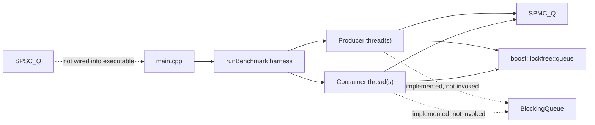

# Queue Design Explorations

> Detailed technical record of experimental queue mechanisms evaluated during
> development. These mechanisms are not public APIs or current performance
> evidence. They are retained to make the resulting design decisions
> inspectable.

## 1. Executive Summary

The exploration covers a single-producer, multiple-consumer (SPMC) ring with
per-slot synchronization metadata, an SPSC variant, a conventional bounded
blocking queue, and a benchmark against `boost::lockfree::queue`.

The explored code is a deliberately narrow design study rather than a public
library architecture. It has no installable target, automated tests, continuous
integration, package metadata, or supported API. Its limitations are documented
because they explain the contracts, validation gates, and synchronization
boundaries in the current library.

### Exploration at a glance

| Attribute | Explored state |
| --- | --- |
| Primary language | C++20 |
| Build system | CMake 3.27+ |
| Main executable | `queue_experiment` |
| External dependency | Boost headers, specifically Boost.Lockfree |
| Queue models | Experimental SPMC multicast, experimental SPSC, blocking MPMC baseline |
| Payload model | Fixed 64-byte byte buffer per ring slot |
| Tests / CI | None |
| Release artifacts | None |

## 2. Purpose and Scope

The design explores whether per-slot atomic version counters can reduce
contention compared with queue designs that coordinate through global read and
write indices. It was inspired by the CppCon 2022 talk *Trading at Light
Speed*. Two mechanisms were evaluated:

1. An SPMC ring where each consumer independently visits every slot, producing
   multicast-like delivery.
2. An SPSC ring where an `unread` flag prevents overwrite-before-read and a
   version counter coordinates access to a slot.

The exploratory executable benchmarks only the SPMC implementation and
`boost::lockfree::queue`. A blocking queue benchmark exists in code but is not
called by `main()`. The SPSC implementation is compiled as a listed header in
the CMake target but is neither included nor exercised by the executable.

### Non-goals in the exploratory code

- General-purpose variable-sized messages.
- Multiple producers for either lock-free implementation.
- Persistent, distributed, inter-process, or network queues.
- Backpressure with explicit status or waiting in the SPMC implementation.
- A stable library API or ABI.
- Proven lock-free progress, linearizability, or memory safety.
- Reproducible scientific benchmarking across machines.

## 3. Experimental Layout

```text
queue_experiment/
|-- CMakeLists.txt             CMake project and experiment executable
|-- README.md                  Conceptual overview and benchmark narrative
|-- assets/                     Optional design and benchmark illustrations
`-- src/
    |-- main.cpp               Producers, consumers, benchmark scenarios, entry point
    |-- benchmark.h            Benchmark callable type and declaration
    |-- benchmark.cpp          Thread launch, timing, stop, join, and completion log
    |-- spmc_q.h               Per-slot-version SPMC ring experiment
    |-- spsc.h                 SPSC ring experiment
    `-- BlockingQueue.h        Mutex/condition-variable bounded queue baseline
```

The explored layout has no generated source files, submodules, vendored
dependencies, test directories, or deployment assets.

## 4. System Architecture



The exploration is a single-process benchmark application. `main.cpp` constructs a
queue, wraps queue-specific producer and consumer functions, and delegates
thread management to `runBenchmark`. Each scenario runs for five seconds,
stops through a shared atomic boolean, joins all threads, and prints a total
operation count.

## 5. Data Model and Shared Types

Both experimental headers independently declare the following names in the
global namespace:

- `BlockVersion`: `uint32_t`.
- `MessageSize`: `uint32_t`.
- `WriteCallback`: `std::function<void(uint8_t*)>`.
- `Block` and `Header`: different structures with the same names.

Because `Block` and `Header` are defined differently in both headers, a
translation unit cannot safely include `spmc_q.h` and `spsc.h` together. This
is an API organization defect; namespaces or queue-specific internal types are
needed before the headers can form one library.

Each experimental slot contains a 64-byte payload and atomic metadata. The
payload is aligned using `std::hardware_destructive_interference_size` to
reduce false sharing. Alignment does not guarantee that all metadata fields
occupy separate cache lines, nor does it make non-atomic payload reads and
writes race-free.

No API validates that `MessageSize <= 64`. A larger size allows callbacks or
`memcpy` calls to access memory outside the slot buffer.

## 6. SPMC Queue

### 6.1 Intended semantics

`SPMC_Q` is a fixed-capacity circular buffer with one producer and multiple
independent consumers. It is closer to a multicast ring than a conventional
SPMC work queue: every consumer keeps its own local `blockIndex`, so multiple
consumers may read the same published slot. A successful read does not claim
the message exclusively.

### 6.2 Public API

```cpp
explicit SPMC_Q(size_t sz);
void Write(MessageSize size, WriteCallback callback);
bool Read(uint64_t blockIndex, uint8_t* destination, MessageSize& size) const;
size_t size() const;
```

- Construction allocates `sz` slots and zero-initializes their atomic state.
- `Write` selects slots internally and does not report full/overwrite status.
- `Read` requires the caller to choose a valid slot index.
- `size` returns ring capacity, not the number of available messages.
- Copy and move are implicitly unavailable because the queue owns a
  `std::unique_ptr<Block[]>` and contains atomics.

Zero capacity is not rejected; constructing `SPMC_Q(0)` leads to modulo by
zero on the first write. `Read` does not bounds-check its index.

### 6.3 Write path

1. Atomically fetch and increment the global `mBlockCounter`.
2. Select `counter % capacity`.
3. Load the slot version and derive a proposed next version.
4. If the observed version is odd, publish an even version to mark writing.
5. Store message size.
6. Invoke the callback to fill the 64-byte payload.
7. Store an odd version to publish readability.

The global counter means producer slot selection is still globally atomic,
although only one producer is supported. Per-slot versions move consumer
coordination away from a single global read index.

### 6.4 Read path

1. Load the caller-selected slot's version.
2. Return `false` if the version is even.
3. Load the size and copy that many bytes into the caller's destination.
4. Store `version + 2`, preserving odd parity so other consumers can read.
5. Return `true`.

The consumer in `main.cpp` advances its local index only after a successful
read and wraps at capacity. This means a consumer can stall on an even slot
until that slot becomes readable. There is no per-consumer sequence number, so
the implementation cannot determine whether a particular consumer already
read a specific generation. A fast consumer can repeatedly read generations,
and a slow consumer can miss overwritten generations.

### 6.5 Concurrency and correctness caveats

The algorithm is not currently demonstrated to be data-race-free or
linearizable:

- Consumers update a slot version with plain atomic `store(version + 2)`.
  Concurrent consumers can overwrite one another's updates.
- A producer may begin rewriting a slot while a consumer is copying its
  non-atomic payload. Version checks occur before the copy, with no validation
  after it, so a consumer can observe torn or mixed payload data.
- Multiple consumers may read the same non-atomic bytes concurrently, which is
  safe only while no writer modifies those bytes.
- Release/acquire ordering publishes prior payload writes, but it does not by
  itself prevent a later writer from racing with an in-progress reader.
- `Write` provides no exception recovery. If its callback throws after an even
  version is published, the slot can remain unreadable.
- The 32-bit version counter eventually wraps. Unsigned wrap is defined, but
  no generation-distance logic handles very old consumers.
- The queue silently overwrites ring slots; it has no full state or consumer
  lag detection.

Accordingly, "lock-free" describes the absence of mutexes in the mechanism,
not a formally established progress or correctness guarantee.

## 7. SPSC Queue

### 7.1 Intended semantics

`SPSC_Q` attempts exactly-once consumption by combining per-slot version parity
with an atomic `unread` flag. One producer chooses slots using a global write
counter. One consumer supplies the slot index it wants to read.

### 7.2 Public API

```cpp
explicit SPSC_Q(size_t sz);
Result Write(MessageSize size, WriteCallback callback);
bool read(int index, uint8_t* destination, MessageSize& size);
```

`Result` is either `SUCCESS` or `ERROR`; `ERROR` means the selected slot appears
to be in an active read. Naming is inconsistent with SPMC (`read` versus
`Read`). There is no capacity accessor and no bounds or size validation.

### 7.3 State protocol

- Initial state: version `0`, `unread == false`.
- After a write: payload and size are filled, `unread` becomes `true`, and the
  version increments to odd.
- A reader seeing odd parity attempts `unread: true -> false` with compare and
  exchange. On success it copies the payload and stores the next even version.
- A writer first attempts `unread: true -> false`. If that fails and the
  version is odd, it returns `ERROR`; otherwise it proceeds to write.

### 7.4 Caveats

- The queue is not integrated into benchmarks or tests, so behavior is
  unverified in this design exploration.
- The writer increments its global slot counter before knowing whether the
  slot can be written. An `ERROR` skips that ring position until wraparound.
- The synchronization protocol is subtle and has no stress, sanitizer, or
  model-based tests establishing race freedom.
- Size, capacity, and index validation are absent.
- The callback exception handler restores `unread == false`, but size or
  payload may already be partially modified.
- `std::memcpy` does not throw under ordinary C++ semantics, so the read-side
  exception handler does not protect against invalid buffers or sizes.
- The comment says each slot is 512 bytes, while the payload array is 64 bytes.

## 8. Blocking Queue Baseline

`BlockingQueue<T>` is a bounded FIFO implemented with `std::queue`, one mutex,
and one condition variable.

```cpp
explicit BlockingQueue(size_t maxSize);
void push(const T& item);
T pop();
```

`push` waits until there is space; `pop` waits until data exists. Both unlock
before `notify_all`. The implementation supports multiple producers and
consumers through mutual exclusion, but it has no close/stop operation,
non-blocking methods, timed methods, size inspection, or zero-capacity guard.

The missing close operation affects benchmark termination: a blocking consumer
can remain inside `pop()` after `running` becomes false if the queue is empty
and no producer subsequently pushes. The explored `main()` avoids this because
it does not invoke `test_blocking()`, but enabling that test can hang during
thread join.

## 9. Benchmark Harness

### 9.1 Execution flow

`runBenchmark` accepts type-erased producer and consumer callables with the
signature `void(std::atomic<bool>&)`. It:

1. Initializes `running` to `true`.
2. Starts the requested producer threads.
3. Starts the requested consumer threads.
4. Sleeps for the configured whole number of seconds.
5. Stores `false` into `running`.
6. Joins producer threads, then consumer threads.
7. Prints a completion message.

`startBenchmark` adapts queue-specific functions, calls the harness, and
prints the final shared `std::atomic<int>` message count.

### 9.2 Scenarios in source

Each suite creates a capacity-1024 queue and runs for five seconds with one
producer and 1, 3, then 10 consumers.

| Suite | Implemented | Called by `main()` |
| --- | --- | --- |
| SPMC | Yes | Yes |
| Boost.Lockfree | Yes | Yes |
| Blocking queue | Yes | No |
| SPSC | No benchmark adapter | No |

The SPMC producer writes null-terminated strings such as `Message 42`; its
consumers copy into 64-byte stack buffers. The Boost and blocking baselines
pass integers. Payload work and delivery semantics therefore differ.

### 9.3 Meaning of the count

For Boost and the blocking queue, each successful pop removes one item, so the
count represents distributed work. For SPMC, every consumer can count a read
of the same slot generation, so the count represents aggregate consumer reads
in a multicast-like design. It is not equivalent to unique messages produced
or delivered.

`messageCount` is a 32-bit-ish `std::atomic<int>` and can overflow during a
high-throughput run. No warm-up, repetitions, confidence intervals, CPU
affinity, compiler mode report, latency measurement, fairness measure, or
correctness checksum is present.

### 9.4 Delivery semantics diagram

[`assets/delivery_semantics_comparison.svg`](assets/delivery_semantics_comparison.svg)
documents the accounting distinction that the maintained benchmark enforces:
work-sharing queues count exclusive pops, while multicast SPMC counts aggregate
consumer observations of retained messages. The diagram is explanatory contract
documentation, not a reproducible performance result or ranking.

## 10. Build and Toolchain

### 10.1 Declared configuration

`CMakeLists.txt` declares:

- Minimum CMake version 3.27.
- Project name `queue_experiment`.
- Required C++20.
- Required Boost discovery.
- Executable target `queue_experiment`.
- `src/` as an include directory.
- Hard-coded Homebrew paths for Boost and LLVM under `/opt/homebrew/opt`.

### 10.2 Explored build constraints

The CMake file is macOS/Homebrew-specific. It sets compilers after the
`project()` call, which is too late for reliable compiler selection, and the
hard-coded paths may not exist. It uses directory-wide include/link commands
instead of target-scoped configuration. Boost.Lockfree is generally
header-based, but the project still links `${Boost_LIBRARIES}`.

The environment evaluation found:

- `cmake` is not installed or not on `PATH`.
- `/opt/homebrew/opt/boost` and `/opt/homebrew/opt/llvm` do not exist.
- Apple Clang 17 is available.
- Direct syntax checking of the executable fails because
  `boost/lockfree/queue.hpp` is unavailable.
- Each experimental header passes an isolated Apple Clang C++20 syntax check.

The explored build requires CMake 3.27+, a C++20 compiler, threading support,
and Boost headers. Once those exist and CMake is made portable, the intended
workflow is:

```sh
cmake -S . -B build -DCMAKE_BUILD_TYPE=Release
cmake --build build --parallel
./build/queue_experiment
```

Release mode matters for performance measurements. The explored build does not
define warning flags, optimization flags, sanitizer presets, install rules, or
CTest targets.

## 11. Dependencies and Platform Assumptions

### Runtime and standard-library dependencies

- C++ threads, atomics, mutexes, and condition variables.
- A standard library exposing `std::hardware_destructive_interference_size`.
- A platform where the chosen atomic types provide suitable operations.

### Third-party dependencies

- Boost.Lockfree, included only by `src/main.cpp` for the benchmark baseline.

### Portability considerations

- Homebrew paths assume Apple Silicon Homebrew layout.
- `std::hardware_destructive_interference_size` availability and value vary by
  compiler and standard library.
- Lock-free status of `std::atomic<uint64_t>` is platform-dependent.
- Performance results are sensitive to CPU topology, cache hierarchy,
  scheduler behavior, compiler, standard library, and optimization level.

## 12. Testing and Quality State

There are no unit, integration, stress, property, benchmark-regression, or
sanitizer tests. CTest is not enabled. There is no CI configuration.

The highest-value missing verification is:

1. Boundary tests for zero capacity, invalid indices, size 0, size 64, and
   size greater than 64.
2. Deterministic single-thread state-transition tests for both ring designs.
3. Long-running producer/consumer sequence validation that detects loss,
   duplication, stale reads, and torn payloads.
4. ThreadSanitizer runs for payload and metadata races.
5. Stress tests across wraparound and version overflow boundaries.
6. Shutdown tests for blocking consumers.
7. Benchmark tests separating multicast reads, unique deliveries, producer
   throughput, consumer throughput, and latency percentiles.

Until those exist, benchmark completion is not evidence of queue correctness.

## 13. Known Risks and Limitations

### Critical correctness risks

- SPMC payload reads can race with slot rewrites.
- SPMC version stores can lose concurrent consumer updates.
- Message sizes can exceed the 64-byte payload.
- Zero-capacity construction leads to invalid modulo operations.
- Caller-provided indices and destination capacity are unchecked.

### Build and integration risks

- The explored CMake configuration is tied to local Homebrew paths that may be
  absent.
- Boost is mandatory for the only executable, even though the core queue does
  not otherwise require it.
- Both experimental headers define conflicting global type names.
- No automated build verifies changes.

### Benchmark validity risks

- Compared queues have different semantics and payloads.
- Counts are aggregate operations rather than comparable unique deliveries.
- Benchmark-unit diagrams are explanatory and are not performance evidence.
- Blocking tests can hang and are currently disabled.
- Correctness is not checked during measurement.

### Product and maintenance limitations

- No stable API, semantic versioning, changelog, contribution guide, or issue
  templates.
- No documentation for ownership, support, releases, or compatibility.
- Missing ignore rules leave build artifacts vulnerable to accidental tracking.

## 14. Observability and Failure Behavior

Observability is limited to two console lines per benchmark scenario: a
completion message and a total count. There are no logs for configuration,
queue failures, dropped/overwritten messages, producer count, CPU/compiler
details, or invalid inputs.

Most failures are implicit:

- SPMC writes cannot report rejection or overwrite.
- SPMC reads return only ready/not-ready.
- SPSC writes return the broad `ERROR` enum value.
- Allocation failure propagates as a standard exception.
- Callback exceptions propagate, with incomplete recovery depending on queue.
- Invalid sizes and indices produce undefined behavior rather than diagnostics.
- Blocking operations have no cancellation path.

## 15. Safe Contribution Boundaries

Until the algorithms are formally corrected and tested, changes should avoid
making stronger safety or performance claims. Preserve these distinctions:

- Multicast delivery is not work-sharing SPMC delivery.
- Throughput is not correctness.
- Atomic metadata does not automatically protect non-atomic payload storage.
- "No mutex" is not sufficient proof of the standard lock-free progress
  property.

For implementation work, prefer small, independently testable stages:

1. Make the build portable and add warnings/tests without changing queue
   behavior.
2. Namespace types and define explicit queue contracts.
3. Add input validation and shutdown behavior.
4. Build correctness tests that fail on the explored defects.
5. Redesign synchronization based on stated delivery semantics.
6. Benchmark only after correctness gates pass.

## 16. Resulting Architecture

The resulting maintainable architecture is a header/library target plus
separate test and benchmark executables:

```text
include/orbitqueue/
|-- spmc_multicast_queue.h
|-- spsc_queue.h
`-- blocking_queue.h
src/
`-- (non-template implementation, if needed)
tests/
|-- queue_contract_tests.cpp
`-- concurrency_stress_tests.cpp
benchmarks/
`-- queue_benchmark.cpp
```

Each queue should document capacity rules, ownership, delivery semantics,
overflow behavior, progress guarantees, memory ordering, payload constraints,
and shutdown behavior. Benchmarks should emit machine-readable raw data and
environment metadata, then generate charts from tracked scripts.

## 17. Engineering Work Derived From the Exploration

### Correctness and buildability

- Remove hard-coded compiler/dependency paths and use target-scoped CMake.
- Add a library target, CTest, and a basic CI matrix.
- Reject zero capacity, enforce payload bounds, and prevent invalid indexing.
- Separate conflicting types into the `orbitqueue` namespace.
- Specify whether SPMC means multicast or exclusive work distribution.
- Replace or redesign the SPMC protocol to eliminate payload races and lost
  consumer state; verify with ThreadSanitizer and sequence-bearing payloads.

### Usability and observability

- Add explicit `try_write`/`try_read` results with meaningful error states.
- Add close/cancellation semantics to blocking operations.
- Integrate and test SPSC or remove it from the advertised project scope.
- Add warning-clean builds and sanitizer presets.
- Record dropped, overwritten, and uniquely delivered messages.

### Reproducible measurement

- Split correctness tests from benchmark code.
- Normalize payload size and delivery semantics across comparisons.
- Measure producer throughput, unique delivery throughput, and latency.
- Add warm-up, repeated trials, summary statistics, CPU affinity options, and
  environment capture.
- Track benchmark raw data and chart-generation scripts.

## 18. Contributor Checklist

Before changing concurrency logic:

1. Read `README.md`, this document, and both queue headers.
2. State the intended queue contract in the change: producer count, consumer
   count, multicast versus work sharing, overflow, ordering, and shutdown.
3. Add a test that exposes the behavior being changed.
4. Run warning-enabled release and debug builds.
5. Run unit tests, stress tests, AddressSanitizer/UndefinedBehaviorSanitizer,
   and ThreadSanitizer where supported.
6. Run benchmarks only after correctness validation and record the full
   environment.

Do not use the illustrative bar chart as a regression baseline; its raw data
and generation process cannot be reproduced.

## 19. Exploration Validation Record

The experimental mechanisms were evaluated from their complete source and both
design images. The static validation record was:

- Isolated `spmc_q.h` Apple Clang 17 C++20 syntax check: passed.
- Isolated `spsc.h` Apple Clang 17 C++20 syntax check: passed.
- Full executable syntax check: blocked by missing Boost headers.
- CMake configure/build/test: not run because `cmake`, Boost, and the declared
  Homebrew LLVM path were unavailable in the evaluation environment.
- Runtime benchmark: not run because the executable could not be built.

These results describe only the experimental mechanisms. Current library
validation is recorded in [`../PROJECT_CONTEXT.md`](../PROJECT_CONTEXT.md).
